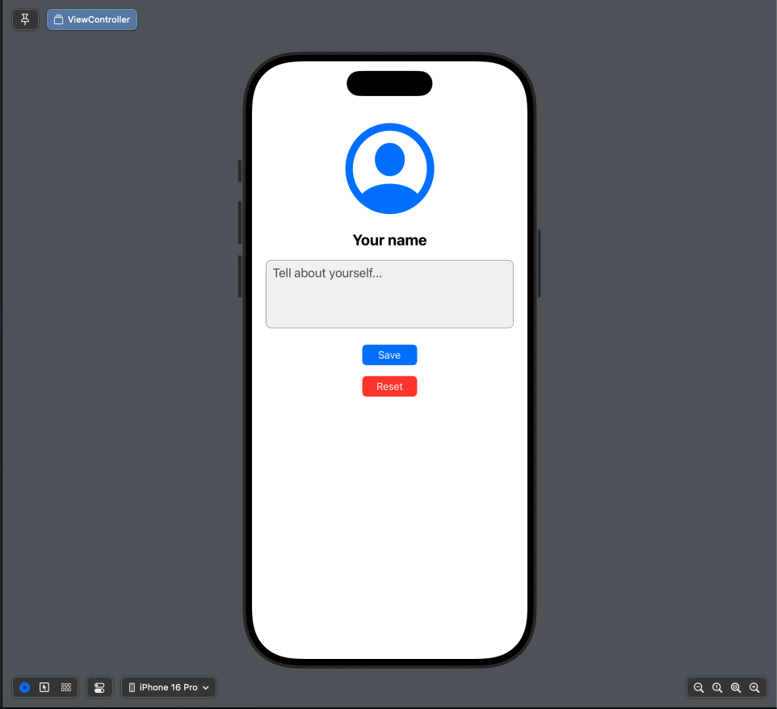

# SimpleProfileCard

SimpleProfileCard — это базовое iOS-приложение, написанное на Swift с использованием UIKit. Оно позволяет пользователю настроить собственный мини-профиль с изображением, именем и краткой биографией. Вся информация сохраняется локально на устройстве с помощью `UserDefaults`.

## 🧰 Технологии

- Swift
- UIKit
- UserDefaults
- UIStackView
- UIImagePickerController
- UIImageView
- UILabel
- UITextView
- UIButton

## 📸 Возможности

- Загрузка изображения профиля из галереи
- Редактирование имени и краткой биографии
- Сохранение и автоматическая загрузка данных при повторном открытии приложения
- Сброс данных профиля с подтверждением

## 📱 Скриншоты

> 
